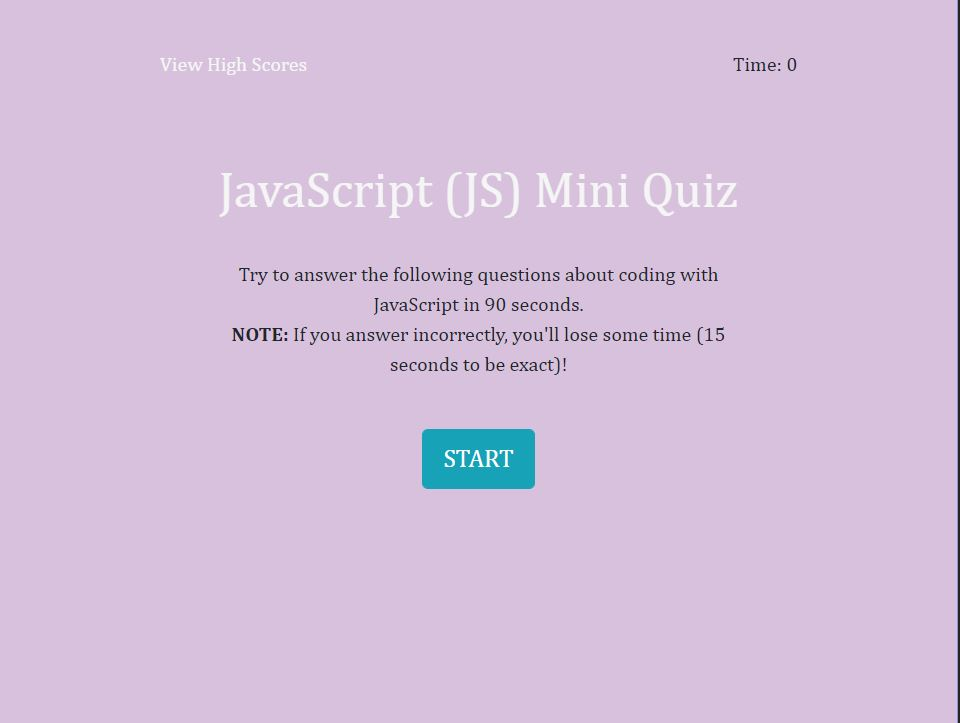

# [Code-Quiz](https://lbernadel.github.io/Code-Quiz/)

## Description
The purpose of this assignment was to create a timer-based coding assessment using vanilla JavaScript that behaves like so:

The application has a few multiple choice questions and the ability to store top scores on the user's device. The number of questions decides the length of time for the quiz (15 seconds/question) once the user clicks "Start", but they are penalized 10 seconds if they answer a question incorrectly. The final score is based on the amount remaining on the timer.

At the end of the quiz (when the user answers all questions or time is up), upon viewing their score, the user is able to enter their initials to add their score to the High Scores list. Once they enter their initials, the scoreboard will appear with an option to clear the board or restart the quiz.

Relevant new subject matter from the week: Web APIs, Data Persistence, JS Timers

## Challenges
This entire activity was very difficult. I really don't understand what I'm doing with the DOM and Local storage and it took forever just to figure out how to get my timer working. I didn't understand how to display the questions individually or if I needed to use JSON methods so I couldn't move forward for the longest time. I tried looking at online sources and class examples multiple times and was still confused after 2 days with several hours of the same cycle. I feel like my comprehension is lagging compared to the pace of this subject matter.

I understood how to piece together the front-end components and organize them but not how to combine that with the functionality on the back-end.

**Update**: About two weeks later, I understood more about how to organize my functions and utilize click handlers to move through the questions while evaluating user choices properly (thanks to my TA, Alex). With the help of my tutor, Phil, I then came to understand the difference between the JS timer functions. Honestly, it still seemed complex in the sense of the amount of moving parts, but the structure made more sense to me.

The only thing I still don't fully understand is how to properly interact with Local Storage, but thankfully my other TA, Cassidy, helped with that. This assignment was actually incredibly challenging.

### Sources
- textContent vs innerHTML/innerText 
  - https://developer.mozilla.org/en-US/docs/Web/API/Node/textContent#Differences_from_innerText
  - https://developer.mozilla.org/en-US/docs/Web/API/Element/innerHTML

- Hide & Seek w/ attributes
  - https://developer.mozilla.org/en-US/docs/Web/HTML/Global_attributes/hidden
  - https://developer.mozilla.org/en-US/docs/Web/API/HTMLElement/hidden
  - https://www.w3schools.com/css/css_display_visibility.asp

- Accessing array items
  - https://developer.mozilla.org/en-US/docs/Web/JavaScript/Reference/Global_Objects/Array
  - https://developer.mozilla.org/en-US/docs/Web/JavaScript/Reference/Global_Objects/Array/prototype
  - https://developer.mozilla.org/en-US/docs/Web/JavaScript/Reference/Global_Objects/Array/forEach

- Replacing child elements
  - https://www.geeksforgeeks.org/remove-all-the-child-elements-of-a-dom-node-in-javascript/
  - https://developer.mozilla.org/en-US/docs/Web/API/Node/replaceChild

- Evaluating User Answer
  - https://www.w3schools.com/jsref/prop_node_nodevalue.asp

- Redirecting Pages
  - https://developer.mozilla.org/en-US/docs/Web/API/History_API

- Local Storage
  - https://developer.mozilla.org/en-US/docs/Web/API/Window/localStorage

- Timers
  - https://medium.com/@monica1109/scheduling-settimeout-and-setinterval-ca2ee50cd99f